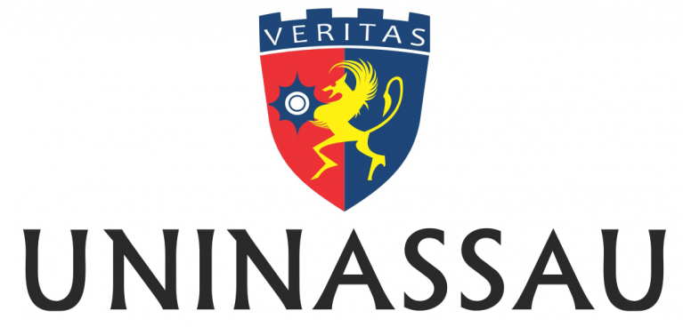

:::: titlepage
::: center
{width="5cm"}

**CENTRO UNIVERSITÁRIO MAURÍCIO DE NASSAU**\
CURSO DE CIÊNCIA DA COMPUTAÇÃO

**TempleOS: Estudo e Análise de um Sistema Operacional**\
Instalação, Estrutura e Funcionamento do TempleOS

**Integrantes**\
Natan Gabriel de Souza Miranda\
João Victor Soares de Lima\
Kamilly Stephany Saraiva Santos\
Samuel Alexandre Correia da Silva\
Crytian Pinheiro Aguiar\
Roberto Matheus Nunes dos Santos\
Paulo Israel Pinho Filho

Disciplina: Sistemas Operacionais\
Professor: Anderlan

Maceió - AL\
2026
:::
::::

:::: titlepage
::: center
**TempleOS: Estudo e Análise de um Sistema Operacional**\
Trabalho apresentado à disciplina de Sistemas Operacionais do curso de
Ciência da Computação do Centro Universitário Maurício de Nassau ---
UNINASSAU, como requisito parcial para obtenção de nota.\
Professor: Anderlan

Maceió - AL\
2026
:::
::::

# Resumo {#resumo .unnumbered}

Este trabalho apresenta um estudo sobre o sistema operacional TempleOS,
desenvolvido por Terry A. Davis. O objetivo foi analisar sua estrutura,
funcionamento interno, kernel, linguagem de programação e processo de
instalação em máquina virtual. Durante o estudo foram realizadas
demonstrações práticas do sistema, incluindo execução de programas e
utilização de recursos nativos. O TempleOS apresenta uma arquitetura
simples e educacional, permitindo compreender conceitos fundamentais de
sistemas operacionais.

**Palavras-chave:** TempleOS. Sistemas Operacionais. Kernel. HolyC.
Máquina Virtual.

# Introdução

Os sistemas operacionais desempenham papel fundamental no funcionamento
dos computadores modernos, sendo responsáveis pelo gerenciamento de
recursos de hardware e software, além de fornecer uma interface entre o
usuário e a máquina.

Entre os diversos sistemas existentes, destaca-se o TempleOS,
desenvolvido por Terry A. Davis. O projeto tornou-se conhecido por ter
sido construído praticamente por uma única pessoa e por possuir uma
arquitetura relativamente simples quando comparada a sistemas modernos
como Windows e Linux.

A análise de um sistema como o TempleOS permite compreender princípios
de design de kernel, linguagem de programação integrada e as limitações
e oportunidades de um sistema educacional.

Este trabalho tem como objetivo apresentar um panorama completo do
TempleOS, incluindo sua história, arquitetura, kernel, linguagem HolyC,
instalação em máquina virtual e a experiência de uso por meio de
demonstrações práticas.

# História do TempleOS

O TempleOS é um sistema operacional de 64 bits criado por Terry A.
Davis. O desenvolvimento do projeto iniciou por volta de 2003 e foi
conduzido durante mais de uma década, com lançamentos e atualizações
constantes até sua conclusão no meio da década de 2010.

Além do sistema operacional, Terry Davis desenvolveu o kernel, a
interface gráfica, o compilador e a linguagem de programação HolyC,
tornando o projeto único em sua integração total entre software e
ferramentas de desenvolvimento.

O projeto também é notório por sua filosofia de design: um sistema
operacional educativo, leve e voltado ao aprendizado de conceitos
fundamentais de computação.

A comunidade acadêmica e de tecnologia reconhece o TempleOS como um
exemplo raro de trabalho pessoal completo que inclui seu próprio
ambiente de desenvolvimento, sistema de arquivos e interface gráfica.

# Estrutura do Sistema

A arquitetura do TempleOS é composta por diferentes camadas que permitem
a comunicação entre software e hardware.

- Aplicações: programas que rodam diretamente sobre o sistema e
  interagem com o usuário.

- Linguagem HolyC: a linguagem nativa de desenvolvimento, integrada ao
  ambiente e ao compilador do sistema.

- Bibliotecas do Sistema: funções e rotinas que suportam operações de
  entrada e saída, gráficos e gerenciamento de arquivos.

- Kernel: núcleo responsável pelo gerenciamento de recursos,
  interrupções e operações de baixo nível.

- Hardware: processador, memória, dispositivos de armazenamento e
  periféricos.

Essa divisão em camadas destaca a proposta educacional do TempleOS:
apresentar um modelo de sistema operacional claro e enxuto, onde cada
nível pode ser estudado isoladamente.

A simplicidade dessa estrutura torna o TempleOS uma plataforma
interessante para fins educacionais e estudo de sistemas operacionais,
pois elimina grande parte da complexidade presente em sistemas
comerciais.

# Kernel

O kernel é o núcleo do sistema operacional e controla diretamente o
hardware e os recursos do sistema.

O TempleOS utiliza um kernel monolítico, modelo em que os principais
serviços do sistema são carregados e executam dentro do próprio kernel,
sem separação rígida entre processos de sistema e de usuário.

Entre suas principais características destacam-se:

- Arquitetura monolítica;

- Execução em 64 bits;

- Gerenciamento de memória simples e direto;

- Sistema de arquivos próprio, projetado para fácil entendimento;

- Interface gráfica integrada e de baixo nível;

- Baixa complexidade de implementação em comparação com sistemas
  modernos.

O gerenciamento de memória no TempleOS é intencionalmente simples: ele
não usa proteção de memória entre processos e não possui multitarefa
completa, focando em transparência e no aprendizado de como o kernel
lida com alocação e acesso à RAM.

Além disso, o kernel oferece suporte a operações de hardware diretas e
tratamento de interrupções, o que permite ao sistema executar código com
acesso próximo a dispositivos, característica rara em sistemas de alto
nível.

# Linguagem HolyC

O TempleOS utiliza a linguagem HolyC, criada por Terry Davis.

A HolyC é baseada em C e C++, mas possui sintaxe simplificada e recursos
adicionais voltados à integração direta com o sistema operacional, como
chamadas de sistema embutidas e tipos específicos do ambiente.

Uma característica importante é a presença de um compilador integrado ao
próprio sistema, o que permite escrever e testar código sem sair do
ambiente do TempleOS.

Exemplo de código:

    U0 Main()
    {
        "Olá Mundo\n";
    }

No TempleOS, o código pode ser editado e executado com poucos comandos,
tornando o desenvolvimento rápido e acessível mesmo para quem está
aprendendo os conceitos de programação de sistemas.

A integração entre editor, compilador e sistema operacional permite que
programas sejam desenvolvidos e executados diretamente no ambiente
TempleOS, reforçando sua proposta educacional.

# Instalação

A instalação foi realizada utilizando o software VirtualBox, que oferece
suporte a máquinas virtuais em diferentes sistemas operacionais.

As etapas executadas foram:

1.  Download da imagem ISO do TempleOS a partir de uma fonte oficial;

2.  Criação da máquina virtual no VirtualBox, definindo nome e sistema
    operacional como \"Other Windows\" ou \"Other\";

3.  Configuração de memória RAM (recomendada entre 512 MB e 1 GB) e
    criação de um disco virtual com espaço suficiente para o sistema;

4.  Ajuste das opções de armazenamento para inserir a imagem ISO como
    drive de CD/DVD;

5.  Inicialização da máquina virtual pela ISO e acompanhamento das
    instruções na tela;

6.  Conclusão da instalação ou uso do sistema diretamente em modo live,
    conforme a imagem oferecida.

Durante a instalação, a simplicidade do TempleOS se destaca: ele não
exige múltiplas telas de configuração e permite uma instalação
relativamente direta para fins de estudo.

# Demonstração

Durante os testes realizados foi possível explorar diversos recursos do
sistema e entender melhor sua proposta educacional.

Entre as atividades executadas destacam-se:

- Navegação pela interface gráfica;

- Utilização do sistema de ajuda;

- Execução de jogos;

- Visualização de código-fonte;

- Execução de programas HolyC;

- Exploração dos menus e demos do sistema.

## Comandos Básicos do TempleOS

O TempleOS possui atalhos de teclado que auxiliam na navegação e na
execução de ações rápidas. Alguns exemplos básicos observados no uso são:

- `F1` – abre a ajuda integrada do sistema.
- `SHIFT+F7` – exibe uma passagem bíblica ou abre a Bíblia do TempleOS.
- `ESC` – fecha janelas ou retorna ao menu anterior.
- `F7` – acessa demos e exemplos de código em muitos casos.
- `CTRL+S` – salva arquivos ou textos enquanto estiver editando.

Esses comandos complementam a interface simples do TempleOS e são úteis
para explorar o sistema de forma mais ágil.

A interface do TempleOS é direta e voltada à prática, o que facilita a
realização de experimentos sem a sobrecarga de opções avançadas
presentes em outros sistemas.

## Tela Inicial

A tela inicial do TempleOS revela um ambiente semelhante a desktops
antigos, com elementos gráficos simples e um menu de comandos. Essa
simplicidade ajuda a focar na funcionalidade básica do sistema, como
abertura de arquivos e execução de programas.

## Demo Index

O \"Demo Index\" é um dos recursos mais interessantes do TempleOS, pois
reúne demonstrações de funcionalidades, jogos e exemplos de código. Ele
permite ao usuário explorar o que o sistema oferece sem precisar buscar
manualmente cada aplicativo.

## Execução de Jogos

Durante os testes, foram executados jogos simples que ilustram a
capacidade do TempleOS de rodar aplicações gráficas básicas. Esses jogos
mostram como o sistema combina mecânicas de entrada, renderização e som
de forma integrada.

## Código HolyC

O código mostrado no editor do TempleOS evidencia a filosofia do
sistema: programas curtos, diretos e facilmente compiláveis. Essa
abordagem facilita a compreensão do fluxo de execução e a experimentação
de alterações em tempo real.

# Conclusão

O estudo do TempleOS permitiu compreender diversos conceitos
relacionados aos sistemas operacionais, incluindo arquitetura, kernel,
gerenciamento de recursos e linguagens de programação integradas ao
sistema.

Apesar de não ser utilizado comercialmente, o TempleOS possui grande
valor educacional por apresentar uma implementação relativamente simples
e acessível para estudo. Ele serve como um exemplo de como um sistema
operacional completo pode ser construído e mantido por uma única pessoa.

A experiência prática de instalação e utilização do sistema contribuiu
para a compreensão dos conceitos abordados na disciplina de Sistemas
Operacionais, principalmente no que diz respeito a projeto de kernel,
integração com linguagem nativa e operação em ambiente virtual.

O TempleOS demonstra que a clareza conceitual e a simplicidade são
ferramentas importantes para o aprendizado, mesmo que não atendam às
demandas dos sistemas modernos de produção.

# Repositório do Projeto

<https://github.com/SEU-USUARIO/TempleOS>

::: thebibliography
99

TempleOS Official Website. <https://templeos.net/>

TempleOS Downloads - TempleOS Foundation.
<https://templeos.net/templeos/>
:::
